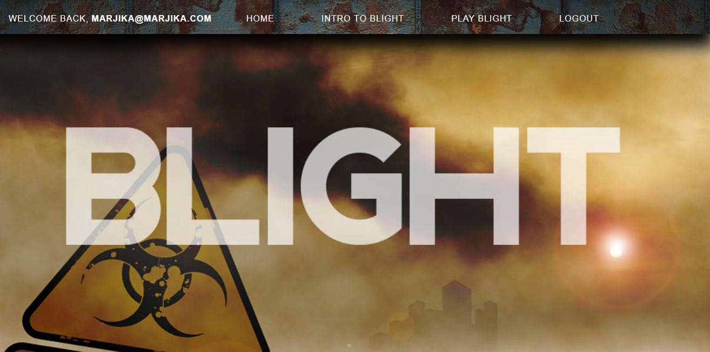
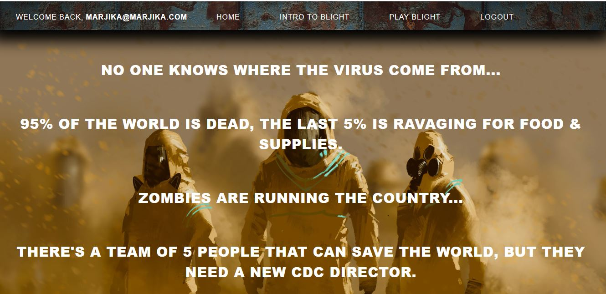
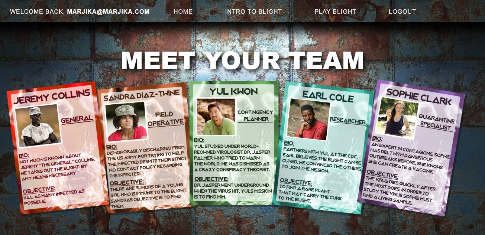
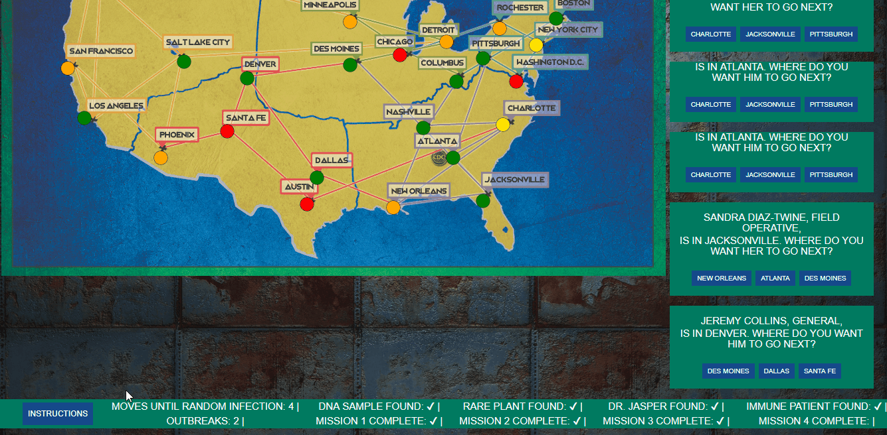

# Blight

### A React full-stack Zombie Apocalypse Game

This full stack MERN application uses react structure to allow a user to play a Zombie game based on some of the logic of the Pandemic Board Game. Login is facilitated with the use of Mern-Passport found at "https://github.com/thechutrain/mern-passport". The user logs in and may choose to watch an introduction or play the game.

### Gameplay

The feeling of Blight is created using appropriate graphics and sound. We used "react-sound" and some great recordings by Wes Mora to help with the introduction and increase the dramatic feel of the game. Laura Smith created the map, player cards, and much of the look and styling (CSS) of the game.  Marjika Howarth pseudocoded, created some styling, and coded most of the components of the game, including the functionality of the map.

The user controls the 5 characters of the game.  Four of the characters must retrieve something which will help to find a cure for a Zombie virus, and the characters must get those items back to the CDC in Atlanta in order to win the game.  The user can move the players from place to place or choose to reduce the infection in the cities where the players are located.  Every four of these moves will result in a new infection of a random level (between 1 and 3) in 3 randomly chosen cities.  These infections are immediately displayed using canvas on the map.  If a city exceeds level 3 infection, there is an outbreak. The user loses the game if there are 8 outbreaks.  There are modals and a footer which keep the user informed of the progress of the game.

### Dependencies

Blight uses Mongo to store the users login information; npm packages include: "axios", "bcrypt", "bcryptjs", "body-parser", "connect-mongo", "dotenv", "express", "express-session", "konva", "mongoose", "morgan", "passport", "passport-google-oauth", "passport-google-oauth20", "passport-local", "react", "react-dom", and "react-router-dom",and "react-sound".

##### About this Application

Blight was created in September and October 2018.  This application aims to use the MERN model and must have access to a database to be hosted.  Blight is hosted at "https://quiet-mesa-51896.herokuapp.com/".  Contributors to this project are: Laura Smith, Marjika Howarth, Wes Mora, and Jesse Hancock.
